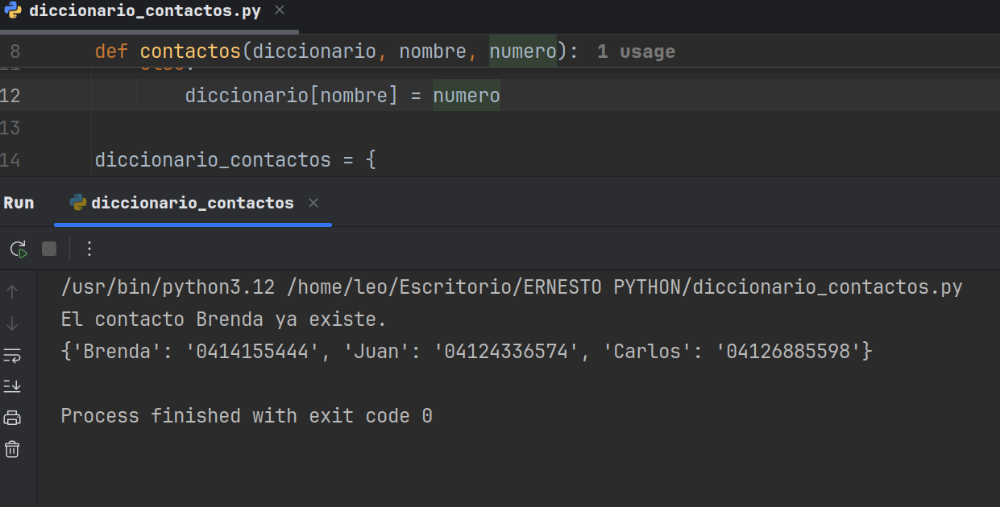

# Gestión de Contactos Básica con Diccionarios en Python
Este repositorio presenta un ejemplo fundamental de cómo utilizar diccionarios en Python para la gestión básica de contactos. 
La función contactos() permite añadir nuevos contactos a un directorio o notificar si el contacto ya existe.

## Funcionalidad Principal:
contactos(diccionario, nombre, numero):

Verifica si un nombre de contacto ya existe en el diccionario proporcionado.

Si el contacto no existe, lo añade al diccionario con su número asociado.

Si el contacto ya existe, imprime un mensaje informando de esta situación.

## ¿Por qué es relevante este ejemplo?
Manipulación de Diccionarios: Demuestra una aplicación práctica del uso de diccionarios para almacenar y acceder a datos clave-valor.

## Control de Flujo (if-else):
Muestra cómo utilizar estructuras condicionales para manejar diferentes escenarios (contacto existente vs. nuevo contacto).

## Fundamentos de Datos: 
Ilustra una forma sencilla y eficiente de organizar información estructurada.
- - 

- * **Autor: @AndresGolDev** - [**Github link:**]([https://github.com/tu-usuario](https://github.com/AndresGolDev)
